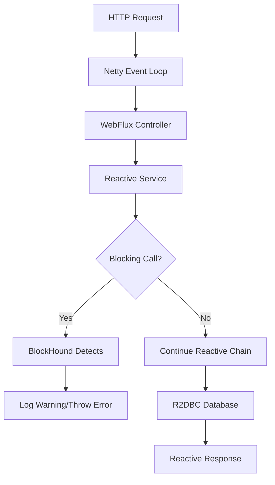

# 🛡️ **BlockHound Integration Guide**

## **Table of Contents**

1. [What is BlockHound?](#what-is-blockhound)
2. [Purpose & Benefits](#purpose--benefits)
3. [How it Works](#how-it-works)
4. [Configuration & Setup](#configuration--setup)
5. [Environment Settings](#environment-settings)
6. [Log Output & Monitoring](#log-output--monitoring)
7. [Grafana Dashboard Integration](#grafana-dashboard-integration)
8. [Common Violations & Solutions](#common-violations--solutions)
9. [Best Practices](#best-practices)
10. [Troubleshooting](#troubleshooting)
11. [References](#references)

---

## **What is BlockHound?**

**BlockHound** is a Java agent that detects blocking calls from non-blocking threads in reactive applications. It's a development and testing tool designed to help maintain the non-blocking nature of reactive programming.

### **Key Concepts:**
- **Reactive Programming**: Asynchronous, non-blocking programming model
- **Blocking Operations**: Synchronous calls that halt thread execution (e.g., `Thread.sleep()`, file I/O)
- **Event Loop**: Non-blocking threads that should never be blocked
- **Reactive Violations**: Blocking calls made from reactive/non-blocking contexts

---

## **Purpose & Benefits**

### **🎯 Primary Purpose**
Ensure your Spring WebFlux application remains truly reactive by detecting accidental blocking operations that could:
- Degrade performance under load
- Cause thread pool starvation
- Break reactive backpressure mechanisms
- Lead to application hangs or crashes

### **✅ Key Benefits**

| Benefit | Description | Impact |
|---------|-------------|---------|
| **Performance Assurance** | Prevents blocking calls that degrade reactive performance | 🚀 High |
| **Early Detection** | Catches violations during development, not production | 🔍 High |
| **Educational Tool** | Helps developers learn reactive programming patterns | 📚 Medium |
| **Code Quality** | Enforces reactive best practices across the team | ✨ High |
| **Debugging Aid** | Identifies hard-to-find blocking operations | 🐛 Medium |
| **Production Safety** | Prevents reactive violations from reaching production | 🛡️ High |

### **🏆 Business Impact**
- **Improved Scalability**: Applications handle more concurrent users
- **Better Resource Utilization**: Optimal use of server threads and memory
- **Reduced Downtime**: Fewer performance-related issues in production
- **Faster Development**: Early feedback prevents late-stage refactoring

---

## **How it Works**

### **🔧 Technical Mechanism**

1. **Java Agent**: BlockHound uses bytecode instrumentation via Java agents
2. **Thread Detection**: Monitors which threads are marked as "non-blocking"
3. **Call Interception**: Intercepts method calls that are known to be blocking
4. **Violation Detection**: Triggers when blocking calls occur from non-blocking threads
5. **Callback Execution**: Executes custom logic (logging/throwing) when violations occur

### **🔄 Reactive Context Flow**



### **⚡ Detection Examples**

```java
// ❌ BlockHound will detect these in reactive contexts:
Thread.sleep(1000);                    // Thread blocking
Files.readAllLines(path);             // Synchronous I/O
Collections.synchronizedList(list);   // Blocking collection
jdbcTemplate.query(sql);              // JDBC blocking call

// ✅ These are reactive and won't trigger BlockHound:
Mono.delay(Duration.ofSeconds(1));    // Non-blocking delay
webClient.get().retrieve();           // Reactive HTTP
r2dbcTemplate.select();               // Reactive database
Flux.fromIterable(list);              // Reactive iteration
```

---

## **Configuration & Setup**

### **📦 Dependencies**

BlockHound is already configured in the project's `pom.xml`:

```xml
<dependency>
    <groupId>io.projectreactor.tools</groupId>
    <artifactId>blockhound</artifactId>
    <version>1.0.13.RELEASE</version>
    <scope>runtime</scope>
</dependency>
```

### **☕ Java 21 Compatibility Configuration**

**Important**: BlockHound requires specific JVM arguments when running on Java 21+ due to module system restrictions. The following configuration has been added to `pom.xml`:

#### **Spring Boot Maven Plugin Configuration**
```xml
<plugin>
    <groupId>org.springframework.boot</groupId>
    <artifactId>spring-boot-maven-plugin</artifactId>
    <configuration>
        <!-- JVM arguments for BlockHound compatibility with Java 21 -->
        <jvmArguments>-XX:+AllowRedefinitionToAddDeleteMethods</jvmArguments>
    </configuration>
</plugin>
```

#### **Surefire Test Plugin Configuration**
```xml
<plugin>
    <groupId>org.apache.maven.plugins</groupId>
    <artifactId>maven-surefire-plugin</artifactId>
    <configuration>
        <argLine>-XX:+AllowRedefinitionToAddDeleteMethods</argLine>
    </configuration>
</plugin>
```

#### **JVM Arguments Explanation**
| JVM Flag | Purpose | Required For |
|----------|---------|--------------|
| `-XX:+AllowRedefinitionToAddDeleteMethods` | Allows BlockHound to instrument bytecode at runtime | Java 13+ |

**Without this configuration**, you'll encounter the error:
```
IllegalStateException: The instrumentation have failed. 
It looks like you're running on JDK 13+. 
You need to add '-XX:+AllowRedefinitionToAddDeleteMethods' JVM flag.
```

#### **Running the Application**
With the configuration in place, you can run the application normally:
```bash
# Development
./mvnw spring-boot:run -Dspring-boot.run.profiles=local

# Testing
./mvnw test

# Production (BlockHound disabled)
./mvnw spring-boot:run -Dspring-boot.run.profiles=prod
```

### **⚙️ Configuration Class**

Located at: `src/main/java/com/weather/config/BlockHoundConfig.java`

```java
@Configuration
@Profile("!prod")  // Active in all environments except production
public class BlockHoundConfig {
    
    @PostConstruct
    public void setupBlockHound() {
        // Sets up BlockHound with logging-only mode
        // Configures allowlist for safe operations
        // Uses reflection to avoid compile-time dependencies
    }
}
```

### **🎛️ Key Configuration Features**

| Feature | Implementation | Purpose |
|---------|----------------|---------|
| **Profile-Based** | `@Profile("!prod")` | Disabled in production for performance |
| **Logging Mode** | Custom callback | Warns instead of throwing exceptions |
| **Reflection-Based** | Dynamic class loading | No compile-time BlockHound dependency |
| **Allowlist** | Predefined safe operations | Prevents false positives |
| **Monitoring Tags** | Special log markers | Enables Grafana dashboard integration |

---

## **Environment Settings**

### **🌍 Environment Activation**

| Environment | Status | Purpose | Behavior |
|-------------|--------|---------|----------|
| **Local** | ✅ Active | Development feedback | Detailed warnings |
| **Dev** | ✅ Active | Integration testing | Standard warnings |
| **QA** | ✅ Active | Pre-production validation | Performance testing |
| **Prod** | ❌ Disabled | Zero performance impact | No BlockHound overhead |

### **🔧 Profile Configuration**

**Automatic Activation:**
```bash
# BlockHound automatically activates based on Spring profiles
export SPRING_PROFILES_ACTIVE=local    # ✅ BlockHound ON
export SPRING_PROFILES_ACTIVE=dev      # ✅ BlockHound ON  
export SPRING_PROFILES_ACTIVE=qa       # ✅ BlockHound ON
export SPRING_PROFILES_ACTIVE=prod     # ❌ BlockHound OFF
```

### **📋 Allowlist Configuration**

The following operations are pre-configured as safe:

```java
// Framework Operations (Safe to block)
java.util.UUID.randomUUID()
java.security.SecureRandom.nextBytes()
org.springframework.util.ClassUtils.forName()

// JSON Serialization (Fast operations)
com.fasterxml.jackson.databind.ObjectMapper.*

// Logging (Async by default)
org.apache.logging.log4j.core.Logger.*

// R2DBC (Reactive but may appear blocking)
io.r2dbc.h2.H2Connection.createStatement()
io.r2dbc.mssql.MssqlConnection.createStatement()

// Application-Specific (Weather Service)
com.weather.service.WeatherDataServiceImpl.validateRequest()
com.weather.mapper.WeatherDataMapper.*
```

---

## **Log Output & Monitoring**

### **📝 Log Format**

When a blocking violation occurs, you'll see:

```log
WARN  c.w.c.BlockHoundConfig - [BLOCKHOUND_VIOLATION] 🚫 REACTIVE VIOLATION: Blocking call detected: java.lang.Thread.sleep
WARN  c.w.c.BlockHoundConfig - [BLOCKHOUND_VIOLATION] 💡 Consider making this operation reactive for better performance
WARN  c.w.c.BlockHoundConfig - [BLOCKHOUND_VIOLATION] 📍 This call should be moved to a separate thread or made non-blocking
WARN  c.w.c.BlockHoundConfig - marker=BLOCKHOUND_VIOLATION severity=HIGH component=reactive-compliance method=java.lang.Thread.sleep
```

### **🏷️ Log Tags Explanation**

| Tag | Purpose | Usage |
|-----|---------|-------|
| `[BLOCKHOUND_VIOLATION]` | Human-readable identifier | Log filtering, visual scanning |
| `marker=BLOCKHOUND_VIOLATION` | Machine-readable tag | Programmatic parsing, alerts |
| `severity=HIGH` | Priority level | Alert routing, dashboard colors |
| `component=reactive-compliance` | System component | Dashboard organization |
| `method=...` | Specific violation | Root cause analysis |

### **📊 Structured Logging Benefits**

- **Easy Filtering**: Simple text search for `[BLOCKHOUND_VIOLATION]`
- **Automated Parsing**: Structured fields for log processors
- **Dashboard Integration**: Direct Grafana/Prometheus integration
- **Alert Routing**: Severity-based notification systems
- **Trend Analysis**: Historical violation tracking

---

## **Grafana Dashboard Integration**

### **📈 Dashboard Queries**

**1. Violation Count Over Time:**
```promql
sum(rate(log_messages_total{message=~".*BLOCKHOUND_VIOLATION.*"}[5m])) by (environment)
```

**2. Top Offending Methods:**
```promql
topk(10, 
  count by (method) (
    {job="weather-service"} |= "marker=BLOCKHOUND_VIOLATION" 
    | regexp `method=(?P<method>[^\s]+)`
  )
)
```

**3. Violations by Severity:**
```promql
count by (severity) (
  {job="weather-service"} |= "marker=BLOCKHOUND_VIOLATION"
  | regexp `severity=(?P<severity>\w+)`
)
```

### **🚨 Alert Configuration**

**High Frequency Alert:**
```yaml
- alert: BlockHoundHighViolations
  expr: sum(rate(log_messages_total{message=~".*BLOCKHOUND_VIOLATION.*"}[1m])) > 10
  for: 2m
  labels:
    severity: warning
    team: backend
  annotations:
    summary: "High frequency of BlockHound violations"
    description: "{{ $value }} blocking calls per minute detected"
```

**New Method Alert:**
```yaml
- alert: BlockHoundNewViolation
  expr: increase(count by (method)(log_messages_total{message=~".*marker=BLOCKHOUND_VIOLATION.*"})[24h]) > 0
  labels:
    severity: info
    team: backend
  annotations:
    summary: "New blocking method detected: {{ $labels.method }}"
```

---

## **Common Violations & Solutions**

### **🔍 Frequent Violations**

| Violation | Common Causes | Reactive Solution |
|-----------|---------------|------------------|
| `Thread.sleep()` | Delays, timeouts | `Mono.delay(Duration)` |
| `Files.readAllLines()` | File operations | `DataBuffer` with `Flux` |
| `RestTemplate` | HTTP calls | `WebClient` |
| `JdbcTemplate` | Database queries | `R2dbcEntityTemplate` |
| `synchronized` blocks | Thread safety | `Mono.fromCallable().subscribeOn()` |
| Blocking I/O | File/network operations | Reactive alternatives or `boundedElastic()` |

### **⚡ Quick Fixes**

**❌ Blocking Code:**
```java
// Violation: Thread.sleep in reactive chain
return Mono.just("data")
    .map(data -> {
        Thread.sleep(1000);  // 🚫 BlockHound violation!
        return data.toUpperCase();
    });
```

**✅ Reactive Code:**
```java
// Solution: Use reactive delay
return Mono.just("data")
    .delayElement(Duration.ofSeconds(1))  // ✅ Non-blocking delay
    .map(String::toUpperCase);
```

**❌ Blocking Database:**
```java
// Violation: JDBC in reactive context
return Mono.fromCallable(() -> {
    return jdbcTemplate.queryForObject(sql, String.class);  // 🚫 Blocking!
});
```

**✅ Reactive Database:**
```java
// Solution: Use R2DBC
return r2dbcEntityTemplate
    .getDatabaseClient()
    .sql(sql)
    .map((row, metadata) -> row.get(0, String.class))
    .one();  // ✅ Fully reactive
```

---

## **Best Practices**

### **🎯 Development Workflow**

1. **Start Development**: BlockHound provides immediate feedback
2. **Review Warnings**: Address violations as they appear
3. **Learn Patterns**: Understand reactive alternatives
4. **Refactor Gradually**: Convert blocking code to reactive
5. **Test Thoroughly**: Verify performance improvements

### **📋 Team Guidelines**

| Practice | Description | Benefit |
|----------|-------------|---------|
| **Daily Log Review** | Check for new violations in daily standup | Early detection |
| **Zero Tolerance** | Don't ignore violations, address them | Code quality |
| **Knowledge Sharing** | Share solutions in team wiki | Learning |
| **Performance Testing** | Measure before/after reactive changes | Validation |
| **Code Reviews** | Include reactive compliance in reviews | Prevention |

### **🔧 Configuration Best Practices**

```java
// ✅ Good: Environment-specific behavior
@Profile("!prod")
public class BlockHoundConfig {
    // Configuration only in non-production
}

// ✅ Good: Comprehensive allowlist
allowBlockingCall(builder, builderClass, "java.util.UUID", "randomUUID");

// ✅ Good: Structured logging
log.warn("marker=BLOCKHOUND_VIOLATION severity=HIGH method={}", method);

// ❌ Avoid: Disabling too many operations
// Don't allowlist everything - defeats the purpose
```

---

## **Troubleshooting**

### **🐛 Common Issues**

**1. BlockHound Not Starting:**
```log
INFO  c.w.c.BlockHoundConfig - BlockHound not found on classpath
```
**Solution:** Verify dependency in `pom.xml` and run `mvn clean install`

**2. False Positives:**
```log
WARN  c.w.c.BlockHoundConfig - [BLOCKHOUND_VIOLATION] ... safe.operation
```
**Solution:** Add to allowlist in `setupAllowList()` method

**3. Performance Impact:**
```
Application startup slower than expected
```
**Solution:** Ensure production profile disables BlockHound

**4. Missing Violations:**
```
Expected violations not appearing in logs
```
**Solution:** Check profile activation and log levels

### **🔍 Debugging Steps**

1. **Verify Profile:** `@Profile("!prod")` annotation active?
2. **Check Logs:** Look for "Installing BlockHound" message
3. **Test Violation:** Add intentional `Thread.sleep()` to test
4. **Log Level:** Ensure WARN level enabled for `com.weather.config`
5. **Classpath:** Verify BlockHound jar in runtime classpath

### **📞 Getting Help**

```bash
# Check active profiles
curl http://localhost:8080/management/env | grep "spring.profiles.active"

# Check BlockHound class loading
curl http://localhost:8080/management/loggers/com.weather.config.BlockHoundConfig

# Test with intentional violation
curl -X POST http://localhost:8080/api/v1/weather/test-blocking
```

---

## **References**

### **📚 Documentation**
- [BlockHound Official Documentation](https://github.com/reactor/BlockHound)
- [Spring WebFlux Reference](https://docs.spring.io/spring-framework/docs/current/reference/html/web-reactive.html)
- [Reactor Core Documentation](https://projectreactor.io/docs/core/release/reference/)
- [R2DBC Specification](https://r2dbc.io/spec/0.8.6.RELEASE/spec/html/)

### **🎯 Best Practices Guides**
- [Reactive Programming Best Practices](https://spring.io/guides/gs/reactive-rest-service/)
- [WebFlux Performance Tuning](https://spring.io/blog/2019/12/13/flight-of-the-flux-3-hopping-threads-and-schedulers)
- [Reactive Error Handling](https://spring.io/blog/2019/06/20/reactive-spring-boot-error-handling)

### **🛠️ Tools & Integrations**
- [Grafana Documentation](https://grafana.com/docs/)
- [Prometheus Alerting](https://prometheus.io/docs/alerting/latest/)
- [Loki Log Aggregation](https://grafana.com/docs/loki/latest/)

### **📖 Learning Resources**
- [Reactive Streams Specification](https://www.reactive-streams.org/)
- [Project Reactor Learning](https://projectreactor.io/learn)
- [Spring WebFlux Workshop](https://github.com/reactor/lite-rx-api-hands-on)

---

**Last Updated:** June 2025  
**Version:** 1.0  
**Maintainer:** Weather Service Team  

*This document is part of the Weather Service technical documentation. For updates or questions, please contact the development team.*